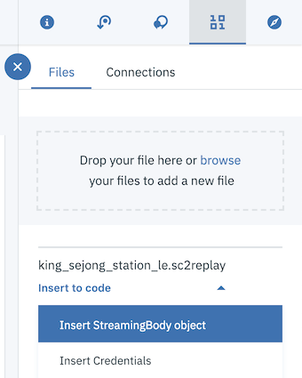
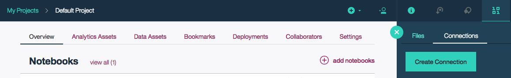
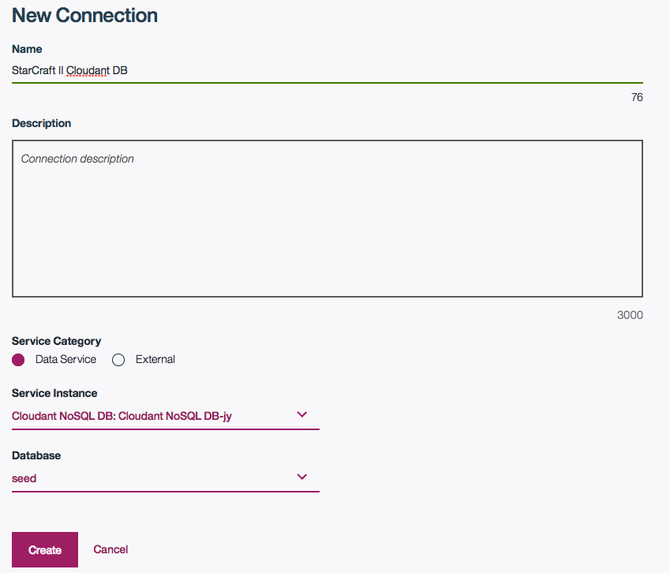

*阅读本文的其他语言版本：[English](README.md)。*
 # 使用 Jupyter Notebook 分析《星际争霸 II》录像

在这个 Code Pattern 中，我们将使用 Jupyter Notebook 分析
《星际争霸 II》录像回放并提取重要洞察。

读者学习完这个 Code Pattern ，将会掌握如何：

* 在 Watson Studio 中创建并运行 Jupyter Notebook。
* 使用 Object Storage 访问录像回放文件。
* 使用 sc2reader 将录像回放加载到 Python 对象中。
* 在结果中检查一些基本的录像回放信息。
* 将比赛细节解析为一个实用对象。
* 使用 Bokeh 图形可视化比赛结果。
* 将处理后的录像回放存储在 Cloudant 中。

这个 Code Pattern 目标读者是需要处理《星际争霸 II》录像回放文件
并构建强大的数据可视化的应用程序开发人员。


## 包含的组件

* [IBM Watson Studio](https://www.ibm.com/cloud/watson-studio)：在一个包含 IBM 插件（比如托管的 Spark）的已配置好的协作环境中，使用 RStudio、Jupyter 和 Python 分析数据。

* [Cloudant NoSQL DB](https://console.ng.bluemix.net/catalog/services/cloudant-nosql-db/?cm_sp=dw-bluemix-_-code-_-devcenter)：Cloudant NoSQL DB 是一个全面托管的数据层，专为利用灵活 JSON 模式的现代 Web 和移动应用程序而设计。

* [Bluemix Object Storage](https://console.ng.bluemix.net/catalog/services/object-storage/?cm_sp=dw-bluemix-_-code-_-devcenter)：一个 Bluemix 服务，提供非结构化的云数据存储来构建和交付富有成本效益的、高度可靠的、能迅速投入市场的应用程序和服务。

## 精选技术

* [Jupyter Notebook](http://jupyter.org/)：一种开源 Web 应用程序，可用于创建和共享包含实时代码、等式、可视化和解释文本的文档。

* [sc2reader](http://sc2reader.readthedocs.io/en/latest/)：一个 Python 库，它从各种《星际争霸 II》(http://us.battle.net/sc2/en/) 资源中提取数据来支持 SC2 社区的工具和服务。

* [pandas](http://pandas.pydata.org/)：一个 Python 库，提供了高性能、易于使用的数据结构。

* [Bokeh](http://bokeh.pydata.org/en/latest/)：一个 Python 交互式可视化库。

# 观看视频

[](https://www.youtube.com/watch?v=iKToQpJZIL0)

# 步骤

按照这些步骤来设置并开始这个 Code Pattern。下面将详细介绍
这些步骤。

1.[注册 Watson Studio](#1-sign-up-for-watson-studio)
2.[创建 Bluemix 服务](#2-create-bluemix-services)
3.[创建 notebook](#3-create-the-notebook)
4.[添加录像文件](#4-add-the-replay-file)
5.[与 Cloudant 建立连接](#5-create-a-connection-to-cloudant)
6.[运行 notebook](#6-run-the-notebook)
7.[分析结果](#7-analyze-the-results)
8.[保存并共享结果](#8-save-and-share)

## 1.注册 Watson Studio

注册 IBM [Watson Studio](http://dataplatform.ibm.com/)。注册 Watson Studio，这会在您的 Bluemix 帐户中创建两个服务：``Apache Spark`` 和 ``Object Storage``。

## 2.创建 Bluemix 服务

单击 **Deploy to Bluemix** 按钮创建下面这个 Bluemix 服务，
或跟随这些链接使用 Bluemix 用户界面来创建该服务。

  * [**Cloudant NoSQL DB**](https://console.ng.bluemix.net/catalog/services/cloudant-nosql-db)

[](https://bluemix.net/deploy?repository=https://github.com/ibm/starcraft2-replay-analysis)

## 3.创建 notebook

从左侧菜单中选择 `My Projects`，然后选择 `Default Project`。
单击 `Add notebooks`（位于右上角）创建一个 notebook。

* 选择 `From URL` 选项卡。
* 为 notebook 输入一个名称。
* 为 notebook 输入一段描述（可选操作）。
* 输入这个 notebook URL： https://github.com/IBM/starcraft2-replay-analysis/blob/master/notebooks/starcraft2_replay_analysis.ipynb
* 单击 `Create Notebook` 按钮。


## 4.添加录像文件

#### 将录像添加到 notebook
使用 `Find and Add Data`（查找 `10/01` 图标）
和它的 `Files` 选项卡。从这里，可以单击
`browse` 并添加一个来自您的计算机的 .SC2Replay 文件。

> 备注：如果没有自己的录像回放，可以克隆这个 git 存储库
来获取我们的示例。查看 `data/example_input` 目录。


#### 创建一个空单元
使用上面的 `+` 按钮创建一个空单元来保存
插入的代码和凭证。可以将此单元放在
顶部或 `Load the replay` 前面的任何位置。

#### 插入到代码中
添加该文件后，使用它的 `Insert to code` 下拉菜单。
确保您的活动单元是之前创建的空单元。
从下拉菜单中选择 `Insert StringIO object`。



备注： 此单元被标记为 hidden_cell，因为它包含
敏感凭证。

#### 修复代码！

我们不想将录像回放文件作为 unicode 文本来处理。我们想要字节。
在插入的代码中，更改此导入：
```python
from io import StringIO
```
要像这样使用 StringIO：
```python
from StringIO import StringIO
```

可更改这个返回行：
```python
return StringIO(resp2.text)
```
要像这样使用 content 字节：
```python
return StringIO(resp2.content)
```


#### 修复变量名
插入的代码包含一个生成带凭证的方法，然后调用这个
生成方法来设置一个具有类似 `data_1` 的名称的变量。如果插入
更多代码，可以重用该方法，而且该变量会发生更改
（例如 `data_2`）。

随后在 notebook 中，我们设置 `replay_file = data_1`。所以您可能需要
修复变量名 `data_1`，使之与您插入的代码相匹配。

## 5.与 Cloudant 建立连接

#### 创建一个数据库
在添加连接之前，您需要一个数据库。
使用 Bluemix 仪表板找到您创建的服务。
如果使用了 `Deploy to Bluemix`，则查找 `sc2-cloudantNoSQLDB-service`。
如果直接在 Bluemix 中创建了该服务，您可能挑选了一个
不同的名称，或者使用了默认名称 `Cloudant NoSQL DB-` 和一个随机
后缀。

* 单击该服务。

* 在 `Manage` 选项卡中单击 `LAUNCH` 按钮。

* 单击左侧菜单上的 Databases 图标。

* 单击顶部的 `Create Database`。提示输入数据库名称时，
可以输入任何名称。只要有任何数据库存在，就可以创建
连接。

#### 将一个新连接添加到项目中
使用 Watson Studio 菜单选择包含该 notebook 的项目。

使用 `Find and Add Data`（查找 `10/01` 图标）
和它的 `Connections` 选项卡。从这里，可以单击 `Create Connection`。



为该连接提供一个名称，并可选择输入一段描述。
在 `Service Category` 下，选择 `Data Service` 按钮。
在 `Target service instance` 下拉菜单中，选择您的 Cloudant NoSQL DB 实例
（例如 `sc2-cloudantNoSQLDB-service`）。



确保已通过 `Connections` 中的一个复选框启用您创建的连接。

#### 创建一个空单元
使用上面的 `+` 按钮创建一个空单元来保存
插入的代码和凭证。可以将此单元放在
顶部或 `Storing replay files` 之前的任何位置。

#### 将 Cloudant 凭证添加到 notebook 中
使用 `Find and Add Data`（查找 `10/01` 图标）
和它的 `Connections` 选项卡。您应该会看到
之前创建的连接名称。
确保您的活动单元是之前创建的空单元。
选择 `Insert to code`（在您的连接名称下）。


备注：这个单元被标记为 `hidden_cell`，因为它包含敏感凭证。

#### 修复变量名
插入的代码包含一个字典，字典中包含分配给变量的凭证，
凭证名称类似于 `credentials_1`。它可能有一个不同的名称（比如 `credentials_2`）。
如果需要，可重命名它或重新分配它。该 notebook 代码假设凭证名称为 `credentials_1`。

## 6.运行该 notebook

执行一个 notebook 时，实际情况是，
按从上往下的顺序执行该 notebook 中的每个代码单元。

可以选择每个代码单元，并在代码单元前面的左侧空白处添加一个标记。标记
格式为 `In [x]:`。根据 notebook 的状态，`x` 可以是：

* 空白，表示该单元从未执行过。
* 一个数字，表示执行此代码步骤的相对顺序。
* 一个 `*`，表示目前正在执行该单元。

可通过多种方式执行 notebook 中的代码单元：

* 一次一个单元。
  * 选择该单元，然后在工具栏中按下 `Play` 按钮。
* 批处理模式，按顺序执行。
  * `Cell` 菜单栏提供了多个选项。例如，可以
    选择 `Run All` 运行 notebook 中的所有单元，或者可以选择 `Run All Below`，
    这将从当前选定单元下方的第一个单元开始执行，然后
    继续执行后面的所有单元。
* 按计划的时间执行。
  * 按下位于 notebook 面板右上部分的 `Schedule`
    按钮。在这里可以计划在未来的某个时刻执行一次 notebook，
    或者按指定的间隔重复执行。

## 7.分析结果

运行 notebook 的结果是一个报告，可与代码一起共享
或单独共享。可以向想要查看您如何得出结论的受众
共享该代码。文本、代码和输出/图表
组合在一个网页中。对于不想查看代码的受众，
可以共享一个仅显示文本和输出/图表的网页。

### 基本输出

基本录像信息会输出，以展示如何开始处理
已加载的录像。当然，输出还有助于识别您在查看
哪个录像。


### 数据准备

如果浏览代码，就会看到准备数据花费了大量精力
。

#### 单元和构建组

为 _known_ 单元和组创建了字符串列表。识别事件类型需要
这些信息。

#### 事件处理函数

编写处理函数方法是为了处理不同类型的事件，
并将信息累积到玩家的事件列表中。

#### ReplayData 类

我们创建了 `ReplayData` 类来获取录像字节流，
并使用所有事件处理函数来处理它们。最终的玩家事件列表存储在
一个 `ReplayData` 对象中。`ReplayData` 类也有一个 `as_dict()`
方法。此方法返回一个 Python 字典，以方便使用我们的
Python 代码处理重放事件。我们也会使用此字典创建一个
Cloudant JSON 文档。

### 可视化

为了可视化录像，我们选择使用两种不同类型的图表，
并展示比赛玩家的并列比较视图。

* Nelson 规则图
* 箱线图

我们为以下每个指标生成这些图表。通过比较这些指标的趋势，
您将对玩家的表现有透彻的
了解。

* 矿物采集速率
* 瓦斯采集速率
* 实际工人数量
* 补给利用率（已用/可用）
* 工人/补给比率（工人数/已用的补给）

#### 箱线图

此刻可以看到，得益于 _pandas DataFrames_ 和 _Bokeh BoxPlot_，
生成箱线图非常轻松。

箱线图是每个玩家的指标的汇总统计数据
的图形表示。“箱子”涵盖从第一个四分位到第三个四分位
的范围。箱子中的水平线显示了均值。“须图”显示了
这些四分位外的数据分布。异常值（如果有）显示为
须图外的标记。

对于每个指标，我们都用一个箱线图来并列显示玩家统计数据。


在上面的屏幕截图中，可以看到并列显示的每分钟瓦斯数量统计结果。
在这场比赛中，Neeb 占据优势。除了显示四分位的箱子和
显示范围的须图，这个示例还有异常值
指标。在许多情况下，没有异常值。

#### Nelson 规则图

Nelson 规则图不那么容易绘制。您会注意到，在帮助器方法中
创建这些图表需要大量代码。

基本图是一个 Bokeh 线图，时间序列中的每个
数据点都有对应的圆圈标记。这显示了玩家的指标随时间变化
的趋势。玩家图表并列显示，以便允许单独缩放
和添加其他许多标注。

我们添加了水平线来显示每位玩家的算数平均数（x-bar，也即样本均值）、第一个和第二个
标准偏差，以及控制上限和下限。

我们使用 `detect_nelson_bias()` 方法检测算数平均数上方（或下方）的
9 个或更多连续点。然后，通过使用 Bokeh 的 `add_layout()` 和
`BoxAnnotation`，将背景绘制为绿色或红色，分别表示在该线
上方或下方出现偏差的范围。

`detect_nelson_trend()` 方法会检测何时出现 6 个或更多的连续点全部增大或减小。
都增加或降低。通过使用 Bokeh 的 `add_layout()` 和 `Arrow`，我们
在图表上绘制箭头来突出显示这些上升或下降趋势。

其结果是一个填满了统计分析数据的并列比较
视图。


在上面的屏幕截图中，可以看到通过 Bokeh 交互式图表获得的
时间/值波动细节。另请注意不同的比例和箭头。
在这次比赛中，Neeb 采取了两次先发制人的行动，在矿物上获得了优势。
如果运行该 notebook，就会看到其他示例显示了获胜者在何处
获得了优势。

### 存储的录像文档

可以浏览您的 Cloudant 数据库来查看存储的录像。执行所有
加载和解析后，我们将它们存储为了 JSON 文档。您将会在
*sc2replays* 数据库中看到所有录像，而在
*sc2recents* 中仅能看到最新的录像。

## 8.保存和共享

### 如何保存工作：

在 `File` 菜单下，可通过多种方式保存 notebook：

* `Save` 将保存 notebook 的当前状态，不含任何版本
  信息。
* `Save Version` 将保存 notebook 的当前状态和一个
  包含日期和时间戳的版本标记。最多可以保存 notebook 的 10 个版本，
  每个版本可通过选择 `Revert To Version` 菜单项进行检索。

### 如何共享工作：

要共享 notebook，可以选择 notebook 面板右上部分中的
Share 按钮。该操作的最终结果是一个 URL
链接，其中将显示您的 notebook 的“只读”版本。可通过多种
选择来准确指定想共享 notebook 中的哪些内容：

* `Only text and output` 将删除 notebook 视图中的所有代码单元。
* `All content excluding sensitive code cells` 将删除任何包含 *sensitive* 标记的
  代码单元。例如，`# @hidden_cell` 用于保护您的
  Bluemix 凭证不被共享。
* `All content, including code` 按原样显示 notebook。
* 菜单中还有各种不同的 `download as` 选项。

# 样本输出

data/examples 中的 sample_output.html 已嵌入交互式 Bokeh 图表的
JavaScript 代码。使用 rawgit.com 通过以下链接
查看它：

[样本输出](https://cdn.rawgit.com/IBM/starcraft2-replay-analysis/46aed2f7f33b7f9e3a9bd06678a13ba150a42c26/data/examples/sample_output.html)

# 故障排除

[参见 DEBUGGING.md.](DEBUGGING.md)

# 许可

[Apache 2.0](LICENSE)
