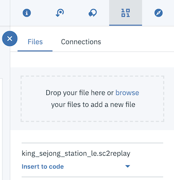

# Jupyter Notebook으로 하는 스타크래프트 II 리플레이 분석

*다른 언어로 보기: [English](README.md).*

이 개발 과정에서는 Jupyter Notebook을 사용하여
스타크래프트 II 리플레이를 분석하여 흥미로운 인사이트를 이끌어냅니다.

이 과정을 마치면 다음의 방법을 배울 수 있습니다:

* DSX에서 쥬피터 노트북의 생성 및 실행
* 리플레이 파일에 액세스하기 위해 DSX Object Storage를 사용하기
* sc2reader를 사용하여 Python 객체에 리플레이를 로딩하기
* 결과에서 몇 가지 기본적인 리플레이 정보를 확인
* 컨테스트 세부 정보를 사용 가능한 객체로 파싱하기
* Bokeh 그래픽으로 컨테스트를 시각화하기
* 처리 완료된 리플레이를 Cloudant에 저장하기

이 과정은 스타크래프트 II 리플레이 파일의 처리를 통해 
멋지게 시각화를 하려는 애플리케이션 개발자에게 적합한 과정일 것입니다.


## 구성 요소

* [IBM Data Science Experience](https://www.ibm.com/bs-en/marketplace/data-science-experience): managed Spark와 같은 IBM 서비스를 포함하는 사전 구성된 협업 환경에서 RStudio, Jupyter 및 Python을 사용하여 데이터를 분석합니다.

* [Cloudant NoSQL DB](https://console.ng.bluemix.net/catalog/services/cloudant-nosql-db/?cm_sp=dw-bluemix-_-code-_-devcenter): Cloudant NoSQL DB는 유연한 JSON 스키마를 활용하는 최신 웹 및 모바일 애플리케이션을 위해 설계된 완전 관리(fully managed)되는 데이터 레이어입니다.

* [Bluemix Object Storage](https://console.ng.bluemix.net/catalog/services/object-storage/?cm_sp=dw-bluemix-_-code-_-devcenter): 구조화되지 않은 클라우드 데이터 저장소를 제공하는 Bluemix 서비스로 안정성 높은, 비용 효율적인 앱 및 서비스를 빠르게 빌드하고 제공합니다

## 주요 기술

* [Jupyter Notebooks](http://jupyter.org/): 라이브 코드, 방정식, 시각 자료 및 텍스트가 포함된 문서를 만들고 공유할 수있는 오픈소스 웹 애플리케이션입니다.

* [sc2reader](http://sc2reader.readthedocs.io/en/latest/): 다양한 [Starcraft II](http://us.battle.net/sc2/en/) 리소스에서 SC2 커뮤니티를 위한 툴과 서비스에 필요한 데이터를 추출하는 Python 라이브러리.

* [pandas](http://pandas.pydata.org/): 고성능의 사용하기 쉬운 데이터 구조를 제공하는 Python 라이브러리.

* [Bokeh](http://bokeh.pydata.org/en/latest/): 인터랙티브한 Python 시각화 라이브러리.

# 비디오 보기

[](https://www.youtube.com/watch?v=iKToQpJZIL0)

# 단계

이 개발 과정을 설정하고 실행하려면 다음의 단계를 따르십시오. 
아래에 자세히 설명되어 있습니다.

1. [Data Science Experience에 가입](#1-data-science-experience에-가입)
1. [Bluemix 서비스 생성](#2-bluemix-서비스-생성)
1. [노트북을 생성합니다](#3-노트북을-생성합니다)
1. [리플레이 파일 추가](#4-리플레이-파일-추가)
1. [Cloudant에 연결 생성](#5-cloudant에-연결-생성)
1. [노트북을 실행합니다](#6-노트북을-실행합니다)
1. [결과 분석](#7-결과-분석)
1. [저장 및 공유](#8-저장-및-공유)

## 1. Data Science Experience에 가입

IBM이 제공하는 [Data Science Experience](http://datascience.ibm.com/)에 가입합니다. Data Science Experience에 가입하면, 두 개의 서비스: ``DSX-Spark`` 와 ``DSX-ObjectStore`` 가 여러분의 Bluemix 계정에 생성됩니다.

## 2. Bluemix 서비스 생성

**Deploy to Bluemix** 버튼을 클릭하여 아래의 Bluemix 서비스를 생성합니다. 
또는 아래의 링크로 가서 Bluemix UI를 사용하여 생성합니다.

  * [**Cloudant NoSQL DB**](https://console.ng.bluemix.net/catalog/services/cloudant-nosql-db)
  
[](https://bluemix.net/deploy?repository=https://github.com/ibm/starcraft2-replay-analysis)

## 3. Notebook을 생성

좌측의 메뉴 중 `My Projects`를 선택한 후 `Default Project`를 클릭합니다.
`Add notebooks` (우측 상단에 위치)를 클릭하여 노트북을 생성합니다.

* `From URL` 탭을 선택합니다.
* 노트북의 이름을 입력합니다.
* 선택적으로 노트북에 대한 설명을 입력합니다.
* 이 노트북 URL을 입력합니다: https://github.com/IBM/starcraft2-replay-analysis/blob/master/notebooks/starcraft2_replay_analysis.ipynb
* `Create Notebook` 버튼을 클릭합니다.


## 4. 리플레이 파일 추가

#### 노트북에 리플레이를 추가합니다
`Find and Add Data` (`10/01` 아이콘을 찾으세요)와 
그 안에 위치한 `Files` 탭을 사용합니다. From there you can click
거기서 `browse`를 클릭하여 여러분 컴퓨터에 있는 .SC2Replay 파일을 추가합니다.

> 참고:  만약 직접 플레이한 게임 리플레이 파일이 없으시면, 이 git repo를 클론해서 샘플을 사용하세요.
`data/example_input` 디렉토리에 있습니다.



#### 셀을 생성합니다
상단의 `+` 버튼을 클릭해 입력된 코드와 신임 정보를 저장할 빈 칸을 생성합니다. 
이 칸을 맨 위에 두시거나 `Load the replay` 앞의 아무 위치에나 두셔도 됩니다 .

#### 코드에 입력합니다
파일을 추가한 이후, 파일의 드롭다운 메뉴에서 `Insert to code` 를 클릭합니다.
활성화 된 셀이 조금 전에 생성한 셀인지 확인합니다.
드롭다운 메뉴에서 `Insert StringIO object`을 선택합니다.


참고: 이 셀은 민감한 개인 정보를 담고 있기 때문에 
hidden_cell 로 분류됩니다.

#### 코드 고치기!

유니코드 텍스트로 리플레이를 처리하는 것만큼은 피하고 싶습니다. 바이트로 처리하겠습니다. 

입력된 코드 중, 아래의 import 라인을:
```python
from io import StringIO
```
StringIO 을 이렇게 사용하도록 수정합니다:
```python
from StringIO import StringIO
```

아래 리턴 라인을:
```python
return StringIO(resp2.text)
```
"컨텐츠"를 바이트로 사용하기 위해 아래와 같이 수정합니다:
```python
return StringIO(resp2.content)
```


#### Fix-up variable names 변수 이름을 변경합니다
입력된 코드에는 신임 정보가 있는 메서드가 호출된 후,
'data_1`과 같은 이름으로 변수를 설정하는 메서드를 호출합니다. 추가적인 입력을 하신다면, 
이 메서드를 다시 사용하여 변수를 변경할 수 있습니다 (예: `data_2`).

이후 노트북에 `replay_file = data_1`를 설정할 것입니다. 그러니 입력된 코드와 맞추기 위해
변수 이름을 `data_1`으로 변경하십시오.

## 5. Cloudant에 연결 생성

#### 데이터베이스 생성
연결을 추가하기 전에 데이터베이스를 확보해야 합니다.
Bluemix 대시보드로 여러분이 생성한 서비스를 검색합니다.
`sc2-cloudantNoSQLDB-service`를 찾기 위해 `Deploy to Bluemix`를 사용하셨다면,
혹은 Bluemix에 서비스를 직접 생성하셨다면 다른 이름을 사용하셨거나 
디폴트 이름인 `Cloudant NoSQL DB-` 에 랜덤한 접미사를 붙여서 사용 중이시라면,

* 서비스를 클릭합니다.

* `Manage` 탭을 열어 `LAUNCH` 버튼을 클릭합니다.

* 좌측 메뉴의 데이터베이스 아이콘을 클릭합니다.

* 상단의 `Create Database`을 클릭합니다. 데이터베이스 이름을 묻는 화면이 나타나면, 
어느 이름이라도 사용할 수 있습니다. 연결 전에는 어떠한 데이터베이스라도 필요하니까요.

#### 프로젝트에 새로운 연결을 추가합니다. 
DSX 메뉴를 사용하여 노트북을 포함하고 있는 프로젝트를 선택합니다.

`Find and Add Data`를 선택하여 (`10/01` 아이콘을 찾으세요)
하위의 `Connections` 탭을 선택합니다. 거기서 `Create Connection`을 클릭합니다.


연결에 이름을 입력하고, 선택적으로 설명도 입력합니다.
`Service Category` 아래의 `Data Service` 버튼을 선택합니다.
드롭다운 메뉴에서 `Target service instance`를 사용해 나의 Cloudant NoSQL DB 인스턴스를 선택합니다 
(e.g., `sc2-cloudantNoSQLDB-service`).


생성한 연결이 'Connections'의 체크박스에 표시가 되어 있는지 확인하십시오.

#### 셀을 생성합니다
상단의 `+` 버튼을 클릭해 입력된 코드와 신임 정보를 저장할 빈 칸을 생성합니다. 
이 칸을 맨 위에 두시거나 `Storing replay files` 앞의 아무 위치에나 두셔도 됩니다.

#### 노트북에 Cloudant 신임정보를 추가합니다
`Find and Add Data`를 사용하여 (`10/01` 아이콘을 찾으세요)
하위의 `Connections` 탭으로 들어가면 이전에 생성한 
연결 이름을 확인할 수 있습니다. 
현재 활성화된 셀이 이전에 생성한 셀인지 확인합니다.
`Insert to code`(생성한 연결 이름 아래의)를 선택합니다.


참고: 이 셀은 민감한 개인 정보를 담고 있기 때문에 hidden_cell 로 분류됩니다.

#### 변수 이름을 변경합니다
입력된 코드는 `credentials_1` 등의 이름을 가진 신임 정보가 있는 딕셔너리를 포함합니다.
다른 이름을 가지고 있을 수도 있습니다 (e.g. `credentials_2`).
필요하시면 다시 이름을 입력할 수 있습니다. 노트북 코도는 그 이름이 The notebook code assumes it will be `credentials_1`일 것으로 .

## 6. 노트북을 실행합니다

노트북이 실행될 때, 실제로 일어나고 있는 것은 노트북의 각 코드 셀이
위에서 아래로 순서대로 실행되는 것입니다.

각 코드 셀은 선택 가능하며 왼쪽 마진에 태그가 붙습니다. 태그 포맷은 `In [x]:`입니다. 
노트북의 상태에 따라, `x` 는:

* 빈 셀: 해당 셀이 한번도 실행되지 않았음을 나타냅니다.
* 숫자: 숫자는 해당 코드 단계가 실행된 상대적인 순서를 나타냅니다.
* `*`: 이것은 해당 셀이 현재 실행 중임을 나타냅니다.

노트북에서 코드 셀을 실행하는 여러 방법이 있습니다:

* 한 번에 한 셀씩 실행하기.
  * 셀을 선택한 다음, 툴바에서 `Play` 버튼을 누릅니다.
* 순차적으로 실행되는 배치 모드로 하기.
  * `Cell` 메뉴바에서 선택할 수 있는 옵션이 몇 가지 있습니다. 예를 들어,
    노트북에 `Run All` 셀을 수행할 수 있습니다, 아니면 `Run All Below`를 수행하면,
    현재 선택된 셀 아래 첫 번째 셀에서 실행을 시작한 다음
    그 뒤의 모든 셀을 계속하여 실행합니다.
* 예약된 시간에 실행하기.
  * Press the `Schedule` button located in the top right section of your notebook
    panel. Here you can schedule your notebook to be executed once at some future
    time, or repeatedly at your specified interval.
    노트북 패널의 오른쪽 상단에있는 `Schedule` 버튼을 누릅니다.
    지정하는 시간에 한 번 실행되도록 노트북을 예약할 수 있습니다.
    시간을 반복하거나 지정된 간격으로 반복할 수 있습니다.

## 7. 결과 분석

The result of running the notebook is a report which may be shared with or
without sharing the code. You can share the code for an audience that wants
to see how you came your conclusions. The text, code and output/charts are
combined in a single web page. For an audience that does not want to see the
code, you can share a web page that only shows text and output/charts.

### Basic output

Basic replay information is printed out to show you how you can start working
with a loaded replay. The output is also, of course, very helpful to identify
which replay you are looking at.


### Data preparation

If you look through the code, you'll see that a lot of work went into preparing
the data.

#### Unit and building groups

List of strings were created for the _known_ units and groups. These are needed
to recognize the event types.

#### Event handlers

Handler methods were written to process the different types of events and
accumulate the information in the player's event list.

#### The ReplayData class

We created the `ReplayData` class to take a replay stream of bytes and process
them with all our event handlers. The resulting player event lists are stored
in a `ReplayData` object. The `ReplayData` class also has an `as_dict()`
method. This method returns a Python dictionary that makes it easy to process
the replay events with our Python code. We also use this dict to create a
Cloudant JSON document.

### Visualization

To visualize the replay we chose to use 2 different types of charts and
show a side-by-side comparison of the competing players.

* Nelson rules charts
* Box plot charts

We generate these charts for each of the following metrics. You will get a
good idea of how the players are performing by comparing the trends for these
metrics.

* Mineral collection rate
* Vespene collection rate
* Active workers count
* Supply utilization (used / available)
* Worker/supply ratio (workers / supply used)

#### Box plot charts

Once you get to this point, you can see that generating a box plot is quite
easy thanks to _pandas DataFrames_ and _Bokeh BoxPlot_.

The box plot is a graphical representation of the summary statistics for the
metric for each player. The "box" covers the range from the first to the third
quartile. The horizontal line in the box shows the mean. The "whisker" shows
the spread of data outside these quartiles. Outliers, if any, show up as
markers outside the whisker lines.

For each metric, we show the players statistics side-by-side using a box plots.


In the above screen shot, you see side-by-side vespene per minute statistics.
In this contest, Neeb had the advantage. In addition to the box which shows
the quartiles and the whisker that shows the range, this example has outlier
indicators. In many cases, there will be no outliers.

#### Nelson rules charts

The Nelson rules charts are not so easy. You'll notice quite a bit of code in
helper methods to create these charts.

The base chart is a Bokeh plotting figure with circle markers for each
data point in the time series. This shows the metric over time for
the player. The player charts are side-by-side to allow separate scales
and plenty of additional annotations.

We add horizontal lines to show our x-bar (sample mean), 1st and 2nd standard
deviations and upper and lower control limits for each player.

We use our `detect_nelson_bias()` method to detect 9 or more consecutive points
above (or below) the x-bar line. Then, using Bokeh's `add_layout()` and
`BoxAnnotation`, we color the background green or red for ranges that show
bias for above or below the line respectively.

Our `detect_nelson_trend()` method detects when 6 or more consecutive points
are all increasing or decreasing. Using Bokeh's `add_layout()` and `Arrow`, we
draw arrows on the chart to highlight these up or down trends.

The result is a side-by-side comparison that is jam-packed with statistical
analysis.


In the above screen shot, you see the time/value hover details that you get
with Bokeh interactive charts. Also notice the different scales and the arrows.
In this contest, Neeb made two early pushes and got an advantage in minerals.
If you run the notebook, you'll see other examples showing where the winner
got the advantage.

### Stored replay documents

You can browse your Cloudant database to see the stored replays. After all
the loading and parsing we stored them as JSON documents. You'll see all
of your replays in the *sc2replays* database and only the latest one in
*sc2recents*.

## 8. 저장 및 

### How to save your work:

Under the `File` menu, there are several ways to save your notebook:

* `Save` will simply save the current state of your notebook, without any version
  information.
* `Save Version` will save your current state of your notebook with a version tag
  that contains a date and time stamp. Up to 10 versions of your notebook can be
  saved, each one retrievable by selecting the `Revert To Version` menu item.

### How to share your work:

You can share your notebook by selecting the “Share” button located in the top
right section of your notebook panel. The end result of this action will be a URL
link that will display a “read-only” version of your notebook. You have several
options to specify exactly what you want shared from your notebook:

* `Only text and output` will remove all code cells from the notebook view.
* `All content excluding sensitive code cells`  will remove any code cells
  that contain a *sensitive* tag. For example, `# @hidden_cell` is used to protect
  your Bluemix credentials from being shared.
* `All content, including code` displays the notebook as is.
* A variety of `download as` options are also available in the menu.

# Sample output

The sample_output.html in data/examples has embedded JavaScript for
interactive Bokeh charts. Use rawgit.com to view it with the following
link:

[Sample Output](https://cdn.rawgit.com/IBM/starcraft2-replay-analysis/46aed2f7f33b7f9e3a9bd06678a13ba150a42c26/data/examples/sample_output.html)

# Troubleshooting

[See DEBUGGING.md.](DEBUGGING.md)

# License

[Apache 2.0](LICENSE)
