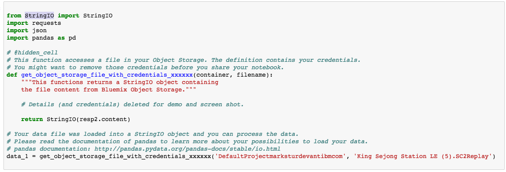
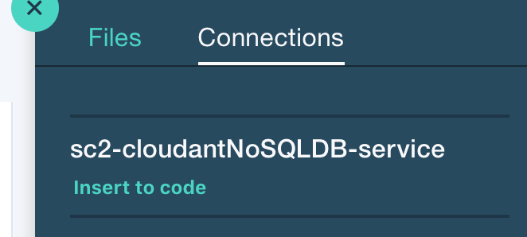

# Jupyter Notebook으로 하는 스타크래프트 II 리플레이 분석

*다른 언어로 보기: [English](README.md).*

이 개발 과정에서는 Jupyter Notebook을 사용하여
스타크래프트 II 리플레이를 분석하여 흥미로운 인사이트를 이끌어냅니다.

이 과정을 마치면 다음의 방법을 배울 수 있습니다:

* DSX에서 쥬피터 노트북의 생성 및 실행
* 리플레이 파일에 액세스하기 위해 DSX Object Storage를 사용하기
* sc2reader를 사용하여 Python 객체에 리플레이 게임을 로딩하기
* 결과에서 몇 가지 기본적인 리플레이 정보를 확인
* 해당 게임 시합의 세부 정보를 사용 가능한 객체로 파싱하기
* Bokeh 그래픽으로 해당 게임 시합을 시각화하기
* 처리 완료된 리플레이를 Cloudant에 저장하기

이 과정은 스타크래프트 II 리플레이 파일의 처리를 통해 
멋지게 시각화를 하려는 애플리케이션 개발자에게 적합한 과정일 것입니다.


## 구성 요소

* [IBM Data Science Experience](https://www.ibm.com/bs-en/marketplace/data-science-experience): managed Spark와 같은 IBM 서비스를 포함하는 사전 구성된 협업 환경에서 RStudio, Jupyter 및 Python을 사용하여 데이터를 분석합니다.

* [Cloudant NoSQL DB](https://console.ng.bluemix.net/catalog/services/cloudant-nosql-db/?cm_sp=dw-bluemix-_-code-_-devcenter): Cloudant NoSQL DB는 유연한 JSON 스키마를 활용하는 최신 웹 및 모바일 애플리케이션을 위해 설계된 완전 관리(fully managed)되는 데이터 레이어입니다.

* [Bluemix Object Storage](https://console.ng.bluemix.net/catalog/services/object-storage/?cm_sp=dw-bluemix-_-code-_-devcenter): 구조화되지 않은 클라우드 데이터 저장소를 제공하는 Bluemix 서비스로 안정성 높은, 비용 효율적인 앱 및 서비스를 빠르게 빌드하고 제공합니다

## 주요 기술

* [Jupyter Notebooks](http://jupyter.org/): 라이브 코드, 방정식, 시각 자료 및 텍스트가 포함된 문서를 만들고 공유할 수있는 오픈소스 웹 애플리케이션입니다.

* [sc2reader](http://sc2reader.readthedocs.io/en/latest/): 다양한 [Starcraft II](http://us.battle.net/sc2/en/) 리소스에서 SC2 커뮤니티를 위한 툴과 서비스에 필요한 데이터를 추출하는 Python 라이브러리.

* [pandas](http://pandas.pydata.org/): 고성능의 사용하기 쉬운 데이터 구조를 제공하는 Python 라이브러리.

* [Bokeh](http://bokeh.pydata.org/en/latest/): 인터랙티브한 Python 시각화 라이브러리.

# 비디오 보기

[](https://www.youtube.com/watch?v=iKToQpJZIL0)

# 단계

이 개발 과정을 설정하고 실행하려면 다음의 단계를 따르십시오. 
아래에 자세히 설명되어 있습니다.

1. [Data Science Experience에 가입](#1-data-science-experience에-가입)
1. [Bluemix 서비스 생성](#2-bluemix-서비스-생성)
1. [노트북을 생성합니다](#3-노트북을-생성합니다)
1. [리플레이 파일 추가](#4-리플레이-파일-추가)
1. [Cloudant에 연결 생성](#5-cloudant에-연결-생성)
1. [노트북을 실행합니다](#6-노트북을-실행합니다)
1. [결과 분석](#7-결과-분석)
1. [저장 및 공유](#8-저장-및-공유)

## 1. Data Science Experience에 가입

IBM이 제공하는 [Data Science Experience](http://datascience.ibm.com/)에 가입합니다. Data Science Experience에 가입하면, 두 개의 서비스: ``DSX-Spark`` 와 ``DSX-ObjectStore`` 가 여러분의 Bluemix 계정에 생성됩니다.

## 2. Bluemix 서비스 생성

**Deploy to Bluemix** 버튼을 클릭하여 아래의 Bluemix 서비스를 생성합니다. 
또는 아래의 링크로 가서 Bluemix UI를 사용하여 생성합니다.

  * [**Cloudant NoSQL DB**](https://console.ng.bluemix.net/catalog/services/cloudant-nosql-db)
  
[](https://bluemix.net/deploy?repository=https://github.com/ibm/starcraft2-replay-analysis)

## 3. 노트북을 생성합니다

좌측의 메뉴 중 `My Projects`를 선택한 후 `Default Project`를 클릭합니다.
`Add notebooks` (우측 상단에 위치)를 클릭하여 노트북을 생성합니다.

* `From URL` 탭을 선택합니다.
* 노트북의 이름을 입력합니다.
* 선택적으로 노트북에 대한 설명을 입력합니다.
* 이 노트북 URL을 입력합니다: https://github.com/IBM/starcraft2-replay-analysis/blob/master/notebooks/starcraft2_replay_analysis.ipynb
* `Create Notebook` 버튼을 클릭합니다.


## 4. 리플레이 파일 추가

#### 노트북에 리플레이를 추가합니다
`Find and Add Data` (`10/01` 아이콘을 찾으세요)와 
그 안에 위치한 `Files` 탭을 사용합니다. 
거기서 `browse`를 클릭하여 여러분 컴퓨터에 있는 .SC2Replay 파일을 추가합니다.

> 참고:  만약 직접 플레이한 게임 리플레이 파일이 없으시면, 이 git repo를 클론해서 샘플을 사용하세요.
`data/example_input` 디렉토리에 있습니다.


#### 셀을 생성합니다
상단의 `+` 버튼을 클릭해 입력된 코드와 신임 정보를 저장할 빈 칸을 생성합니다. 
이 칸을 맨 위에 두시거나 `Load the replay` 앞의 아무 위치에나 두셔도 됩니다 .

#### 코드에 입력합니다
파일을 추가한 이후, 파일의 드롭다운 메뉴에서 `Insert to code` 를 클릭합니다.
활성화 된 셀이 조금 전에 생성한 셀인지 확인합니다.
드롭다운 메뉴에서 `Insert StringIO object`을 선택합니다.


참고: 이 셀은 민감한 개인 정보를 담고 있기 때문에 
hidden_cell 로 분류됩니다.

#### 코드 고치기!

유니코드 텍스트로 리플레이를 처리하는 것만큼은 피하고 싶습니다. 바이트로 처리하겠습니다. 

입력된 코드 중, 아래의 import 라인을:
```python
from io import StringIO
```
StringIO 을 이렇게 사용하도록 수정합니다:
```python
from StringIO import StringIO
```

아래 리턴 라인을:
```python
return StringIO(resp2.text)
```
"컨텐츠"를 바이트로 사용하기 위해 아래와 같이 수정합니다:
```python
return StringIO(resp2.content)
```



#### 변수 이름을 변경합니다
입력된 코드에는 신임 정보가 있는 메서드가 호출된 후,
`data_1`과 같은 이름으로 변수를 설정하는 메서드를 호출합니다. 추가적인 입력을 하신다면, 
이 메서드를 다시 사용하여 변수를 변경할 수 있습니다 (예: `data_2`).

이후 노트북에 `replay_file = data_1`를 설정할 것입니다. 그러니 입력된 코드와 맞추기 위해
변수 이름을 `data_1`으로 변경하십시오.

## 5. Cloudant에 연결 생성

#### 데이터베이스를 생성
연결을 추가하기 전에 데이터베이스를 확보해야 합니다.
Bluemix 대시보드로 여러분이 생성한 서비스를 검색합니다.
`sc2-cloudantNoSQLDB-service`를 찾기 위해 `Deploy to Bluemix`를 사용하셨다면,
혹은 Bluemix에 서비스를 직접 생성하셨다면 다른 이름을 사용하셨거나 
디폴트 이름인 `Cloudant NoSQL DB-` 에 랜덤한 접미사를 붙여서 사용 중이시라면,

* 서비스를 클릭합니다.

* `Manage` 탭을 열어 `LAUNCH` 버튼을 클릭합니다.

* 좌측 메뉴의 데이터베이스 아이콘을 클릭합니다.

* 상단의 `Create Database`을 클릭합니다. 데이터베이스 이름을 묻는 화면이 나타나면, 
어느 이름이라도 사용할 수 있습니다. 연결 전에는 어떠한 데이터베이스라도 필요하니까요.

#### 프로젝트에 새로운 연결을 추가합니다. 
DSX 메뉴를 사용하여 노트북을 포함하고 있는 프로젝트를 선택합니다.

`Find and Add Data`를 선택하여 (`10/01` 아이콘을 찾으세요)
하위의 `Connections` 탭을 선택합니다. 거기서 `Create Connection`을 클릭합니다.


연결에 이름을 입력하고, 선택적으로 설명도 입력합니다.
`Service Category` 아래의 `Data Service` 버튼을 선택합니다.
드롭다운 메뉴에서 `Target service instance`를 사용해 나의 Cloudant NoSQL DB 인스턴스를 선택합니다 
(e.g., `sc2-cloudantNoSQLDB-service`).


생성한 연결이 'Connections'의 체크박스에 표시가 되어 있는지 확인하십시오.

#### 셀을 생성합니다
상단의 `+` 버튼을 클릭해 입력된 코드와 신임 정보를 저장할 빈 칸을 생성합니다. 
이 칸을 맨 위에 두시거나 `Storing replay files` 앞의 아무 위치에나 두셔도 됩니다.

#### 노트북에 Cloudant 신임정보를 추가합니다
`Find and Add Data`를 사용하여 (`10/01` 아이콘을 찾으세요)
하위의 `Connections` 탭으로 들어가면 이전에 생성한 
연결 이름을 확인할 수 있습니다. 
현재 활성화된 셀이 이전에 생성한 셀인지 확인합니다.
`Insert to code`(생성한 연결 이름 아래의)를 선택합니다.



참고: 이 셀은 민감한 개인 정보를 담고 있기 때문에 hidden_cell 로 분류됩니다.

#### 변수 이름을 변경합니다
입력된 코드는 `credentials_1` 등의 이름을 가진 신임 정보가 있는 Python 딕셔너리를 포함합니다.
이 코드가 다른 이름으로 되어 있는 경우 (가령, `credentials_2`),
이름을 다시 입력합니다. 노트북 코드는 변수 이름이 `credentials_1`로 가정합니다. 

## 6. 노트북을 실행합니다

노트북이 실행될 때, 실제로 일어나고 있는 것은 노트북의 각 코드 셀이
위에서 아래로 순서대로 실행되는 것입니다.

각 코드 셀은 선택 가능하며 왼쪽 마진에 태그가 붙습니다. 태그 포맷은 `In [x]:`입니다. 
노트북의 상태에 따라, `x` 는:

* 빈 셀: 해당 셀이 한번도 실행되지 않았음을 나타냅니다.
* 숫자: 숫자는 해당 코드 단계가 실행된 상대적인 순서를 나타냅니다.
* `*`: 이것은 해당 셀이 현재 실행 중임을 나타냅니다.

노트북에서 코드 셀을 실행하는 여러 방법이 있습니다:

* 한 번에 한 셀씩 실행하기.
  * 셀을 선택한 다음, 툴바에서 `Play` 버튼을 누릅니다.
* 순차적으로 실행되는 배치 모드로 하기.
  * `Cell` 메뉴바에서 선택할 수 있는 옵션이 몇 가지 있습니다. 예를 들어,
    노트북에 `Run All` 셀을 수행할 수 있습니다, 아니면 `Run All Below`를 수행하면,
    현재 선택된 셀 아래 첫 번째 셀에서 실행을 시작한 다음
    그 뒤의 모든 셀을 계속하여 실행합니다.
* 예약된 시간에 실행하기.
  * 노트북 패널의 오른쪽 상단에있는 `Schedule` 버튼을 누릅니다.
    지정하는 시간에 한 번 실행되도록 노트북을 예약할 수 있습니다.
    시간을 반복하거나 지정된 간격으로 반복할 수 있습니다.

## 7. 결과 분석

노트북 실행 결과는 코드를 공유 또는 공유하지 않는 리포트입니다. 여러분이 내린 결론에 
이르기까지의 과정을 궁금해하는 분들께 코드를 공유할 수 있습니다. 텍스트, 코드, 결과/차트는 
웹페이지에 종합적으로 보여집니다. 코드를 보길 원하지 않는 분들께는 텍스트와 결과/차트만 보여주는 
웹페이지를 공유하면 됩니다.

### 기본적인 산출물 

기본적인 리플레이 작업 정보로 현재 로딩된 리플레이가 어떻게 작업될 것인지 알 수 있습니다. 
물론, 어느 리플레이 파일을 보고 계신지 구별하기에도 이 산출물이 상당히 유용합니다. 


### 데이터를 준비합니다 

코드를 살펴보면, 데이터를 준비하는데 많은 작업이 진행되었슴을 알 수 있습니다.

#### Unit and building groups 유닛과 빌딩 블록 

the _known_ units (이미 알고 있는 유닛들)과 그룹들에 문자열 리스트를 생성하였습니다. 
이들은 이벤트 타입을 인식합니다. 

#### 이벤트 핸들러 

다른 타입의 이벤트들을 처리하고 플레이어의 이벤트 리스트에 정보를 축적하기 위해 핸들러 메서드들이 작성되었습니다. 

#### ReplayData 클래스

리플레이 바이트 스트림을 가져와서 이벤트 핸들러로 처리하기 위한 
`ReplayData` 클래스를 생성하였습니다. 결과로 나오는 플레이어 이벤트 리스트는
`ReplayData` 객체에 저장됩니다. `ReplayData` 클래스에도 `as_dict()` 메서드가 있습니다.
이 메서드는 Python 코드로 리플레이 이벤트를 쉽게 처리하게 하는 Python 딕셔너리를 리턴합니다. 
Cloudant JSON 문서를 만들 때에도 이 Python 딕셔너리를 사용합니다.

### 시각화 하기

리플레이를 시각화하기 위해 두 종류의 다른 차트로 양쪽 플레이어의 비교 분석을 보여줍니다. 

* Nelson rules 차트
* 박스플롯 차트

다음의 측정 항목 각각에 대한 차트를 생성하겠습니다. 
각 측정 항목별 선수들의 동향을 비교하여 어떻게 플레이하는지에 대해 손쉽게 알 수 있습니다. 

* 미네랄 채취율 
* 베스핀 가스 채취율
* 활동 중인 일꾼 수
* 서플라이 활용 현황 (사용 / 사용 가능)
* 일꾼/서플라이 비율 (일꾼 / 서플라이 사용 수)

#### 박스플롯 차트

_pandas DataFrames_ 와 _Bokeh BoxPlot_ 를 사용하면 박스플롯 차트를 손쉽게 만들 수 있습니다. 

박스플롯은 각 플레이어의 측정 항목별 통계 써머리를 시각적으로 표현합니다. "박스"는 1사분위수부터
3사분위수까지 포함합니다. 박스 안의 수평선은 median(중간값)을 나타냅니다. "위스커"는 
이러한 사분위수 밖에 분포한 데이터의 분포를 나타냅니다. 프로게이머처럼 잘 하시는 분들은 아웃라이너로 
"위스커"선 밖에 표시가 됩니다.

각 측정 항목 별로 플레이어들의 통계를 박스플롯으로 나란히 보여줍니다.


위의 스크린샷에서는 두 플레이어의 베스핀 분당 통계를 볼 수 있습니다.
이 게임 시합에서 Neeb이라는 플레이어가 우위를 점했습니다. 사분위수를 나타내는 박스 그리고
분포 범위를 나타내는 위스크 외에, 이 예제에는 아웃라이어 표시가 있습니다. 
대부분의 경우에는 아웃라이어 표시는 좀처럼 보기 드뭅니다. 

#### Nelson rules 차트

Nelson rules 차트는 조금 어렵습니다. 이러한 차트를 만들려면 꽤 많은 코드에
헬퍼 메서드를 사용해야 합니다. 

기본 차트는 시계열로 각 데이터 포인트를 원으로 표시한 Bokeh 좌표 수치입니다.
이는 시간 경과에 따른 플레이어의 측정 항목 수치를 보여줍니다.
플레이어 차트는 나란히 배치되어 각각의 기준으로 판단하고, 설명을 추가할 수 있습니다. 

x-bar (샘플 평균), 제1 및 제2 표준 편차와 
각 플레이어에 대한 상한 및 하한 제어 한계를 나타내기 위해 평행선을 추가합니다.

`detect_nelson_bias()` 메서드를 사용하여 x-bar 선보다  9점 또는 
그 이상의 점수를 초과하거나 미달하는 것을 감지합니다. 그 이후, Bokeh 중 `add_layout()` 과
`BoxAnnotation`을 사용하여, 그 선을 초과하거나 미달하는 영역의 배경을 
녹색 또는 적색으로 표시합니다.

`detect_nelson_trend()`메서드로는 6점 또는 그 이상의 점수로 증가하거나 감소하는 것을
감지할 수 있습니다. Bokeh 중 `add_layout()` 과 `Arrow`를 사용하여, 화살표로 
증가하거나 감소하는 추세를 차트 상 하이라이트할 수 있습니다.

통계적 분석으로 꽉찬 비교  결과가 도출됩니다. 


위의 스크린 샷처럼 time/value 정보를 Bokeh 인터랙티브 차트에서 얻을 수 있습니다. 
또한 다른 분포도와 화살표도 주의해서 살펴보십시오. 이번 게임 시합에서는 Neeb이 
두 번의 일찍 푸시를 했고, 미네랄에서 우위를 점했습니다.
노트북을 실행하면 승자가 어디에서 우위를 점했는지를 알려주는 다른 예가 표시됩니다.

### Stored replay documents 저장된 리플레이 문서

Cloudant 데이터베이스를 검색하여 저장된 리플레이를 볼 수 있습니다.
모두 JSON 문서로 저장하고 로딩하고 파싱했기 때문입니다.
*sc2replays* 데이터베이스에서는 모든 리플레이를 볼 수 있고, 
*sc2recents* 에서는 최신 리플레이만 열람할 수 있습니다.

## 8. 저장 및 공유

### 작업을 저장하는 방법:

`File` 메뉴 아래, 여러분의 노트북을 저장할 수 있는 몇몇 방법이 있습니다:

* `Save`는 버전 정보 없이, 단순히 현재의 노트북 상태만을 저장합니다 .
* `Save Version`는 날짜와 타임 스탬프가 있는 버전 태그와 함께 노트북의 현재 상태를 저장합니다. 
  10개 버전까지 저장할 수 있으며, `Revert To Version` 메뉴 아이템을 선택하시면,
  각 버전으로 돌아갑니다.

### 작업을 공유하는 방법:

노트북 패널의 오른쪽 섹션 상단에 있는 “Share” 버튼을 선택하여 노트북을 공유할 수 
있습니다. 클릭하면 노트북의 "read only" 버전을 볼 수 있는 URL 링크가 표시됩니다:

* `Only text and output`은 노트북 뷰에서 모든 코드 셀을 제외하고 보여줍니다.
* `All content excluding sensitive code cells`은 노트북  뷰에서 
  *sensitive* 태그가 달린 모든 코드 셀을 제외하고 보여줍니다tag. 예를 들면, `# @hidden_cell` 은
  여러분의 Bluemix 신임 정보가 공유되는 것을 방지합니다.
* `All content, including code` 은 노트북의 상태를 그대로 보여줍니다.
* 그 외 `download as` 옵션들은 메뉴에서 찾아보실 수 있습니다.

# 샘플 산출물

data/examples 아래 위치한 sample_output.html 은 인터렉티브한 Bokeh 차트를 
구성하기 위한 자바스크립트가 임베드되어 있습니다. 아래 링크를 이를 이용하여 보시려면 
rawgit.com을 활용합니다:

[샘플 산출물](https://cdn.rawgit.com/IBM/starcraft2-replay-analysis/46aed2f7f33b7f9e3a9bd06678a13ba150a42c26/data/examples/sample_output.html)

# 문제 해결

[See DEBUGGING.md.](DEBUGGING.md)

# 라이센스

[Apache 2.0](LICENSE)
