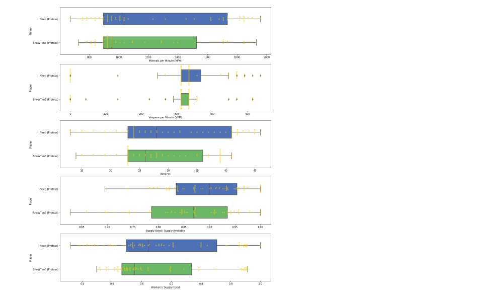

# StarCraft II Replay Analysis with Jupyter Notebooks

*Read this in other languages: [한국어](README-ko.md), [中国](README-cn.md).*

> Data Science Experience is now Watson Studio. Although some images in this code pattern may show the service as Data Science Experience, the steps and processes will still work.

In this Code Pattern we will use Jupyter notebooks to analyze StarCraft II replays and extract interesting insights.

When the reader has completed this Code Pattern, they will understand how to:

* Create and run a Jupyter notebook in Watson Studio.
* Use Object Storage to access a replay file.
* Use sc2reader to load a replay into a Python object.
* Examine some of the basic replay information in the result.
* Parse the contest details into a usable object.
* Visualize the contest with Bokeh graphics.
* Store the processed replay in Cloudant.

The intended audience for this Code Pattern is application developers who
need to process StarCraft II replay files and build powerful visualizations.

## Flow

1. The Developer creates a Jupyter notebook from the included starcraft2_replay_analysis.ipynb file
2. A Starcraft replay file is loaded into IBM Cloud Object Storage
3. The Object is loaded into the Jupyer notebook
4. Processed replay is loaded into Cloudant database for storage

## Included components

* [IBM Watson Studio](https://www.ibm.com/cloud/watson-studio): Analyze data using RStudio, Jupyter, and Python in a configured, collaborative environment that includes IBM value-adds, such as managed Spark.

* [Cloudant NoSQL DB](https://console.ng.bluemix.net/catalog/services/cloudant-nosql-db/?cm_sp=dw-bluemix-_-code-_-devcenter): Cloudant NoSQL DB is a fully managed data layer designed for modern web and mobile applications that leverages a flexible JSON schema.

* [IBM Cloud Object Storage](https://console.ng.bluemix.net/catalog/services/object-storage/?cm_sp=dw-bluemix-_-code-_-devcenter): An IBM Cloud service that provides an unstructured cloud data store to build and deliver cost effective apps and services with high reliability and fast speed to market.

## Featured technologies

* [Jupyter Notebooks](http://jupyter.org/): An open-source web application that allows you to create and share documents that contain live code, equations, visualizations and explanatory text.

* [sc2reader](http://sc2reader.readthedocs.io/en/latest/): A Python library that extracts data from various [Starcraft II](http://us.battle.net/sc2/en/) resources to power tools and services for the SC2 community.

* [pandas](http://pandas.pydata.org/): A Python library providing high-performance, easy-to-use data structures.

* [Bokeh](http://bokeh.pydata.org/en/latest/): A Python interactive visualization library.

# Watch the Video

# Steps

Follow these steps to setup and run this developer Code Pattern. The steps are
described in detail below.

1. [Sign up for Watson Studio](#1-sign-up-for-watson-studio)
1. [Create IBM Cloud services](#2-create-ibm-cloud-services)
1. [Create the notebook](#3-create-the-notebook)
1. [Add the replay file](#4-add-the-replay-file)
1. [Create a connection to Cloudant](#5-create-a-connection-to-cloudant)
1. [Run the notebook](#6-run-the-notebook)
1. [Analyze the results](#7-analyze-the-results)
1. [Save and share](#8-save-and-share)

## 1. Sign up for Watson Studio

Sign up for IBM's [Watson Studio](https://dataplatform.ibm.com). By creating a project in Watson Studio a free tier ``Object Storage`` service will be created in your IBM Cloud account. Take note of your service names as you will need to select them in the following steps.

> Note: When creating your Object Storage service, select the ``Free`` storage type in order to avoid having to pay an upgrade fee.

## 2. Create IBM Cloud services

Create the following IBM Cloud service by clicking the **Deploy to IBM Cloud**
button or by following the links to use the IBM Cloud UI and create it.

  * [**Cloudant NoSQL DB**](https://console.ng.bluemix.net/catalog/services/cloudant-nosql-db)

## 3. Create the notebook

* In [Watson Studio](https://dataplatform.ibm.com), click on `Create notebook` to create a notebook.
* Create a project if necessary, provisioning an object storage service if required.
* In the `Assets` tab, select the `Create notebook` option.
* Select the `From URL` tab.
* Enter a name for the notebook.
* Optionally, enter a description for the notebook.
* Enter this Notebook URL: https://github.com/IBM/starcraft2-replay-analysis/blob/master/notebooks/starcraft2_replay_analysis.ipynb
* Select the free Anaconda runtime.
* Click the `Create` button.

## 4. Add the replay file

#### Add the replay to the notebook
Use `Data` (look for the `10/01` icon)
and its `Files` tab. From there you can click
`browse` and add a .SC2Replay file from your computer.

> Note:  If you don't have your own replays, you can get our example by cloning
this git repo. Use the `data/example_input/king_sejong_station_le.sc2replay` file.

#### Create an empty cell
Use the `+` button above to create an empty cell to hold
the inserted code and credentials. You can put this cell
at the top or anywhere before `Load the replay`.

#### Insert to code
After you add the file, use its `Insert to code` drop-down menu.
Make sure your active cell is the empty one created earlier.
Select `Insert StreamingBody object` from the drop-down menu.

Note: This cell is marked as a hidden_cell because it contains
sensitive credentials.

#### Fix-up variable names
The inserted code includes a generated method with credentials and then calls
the generated method to set a variable with a name like `streaming_body_1`. If you do
additional inserts, the method can be re-used and the variable will change
(e.g. `streaming_body_2`).

Later in the notebook, we set `replay_file = streaming_body_1`. So you might need to
fix the variable name `streaming_body_1` to match your inserted code.

## 5. Create a connection to Cloudant

#### Create a database
Before you an add a connection, you need a database.
Use your IBM Cloud dashboard to find the service you created.
If you used `Deploy to IBM Cloud` look for `sc2-cloudantNoSQLDB-service`.
If you created the service directly in IBM Cloud you may have picked a
different name or used the default name of `Cloudant NoSQL DB-` with a random
suffix.

* Click on the service.

* Use the `Manage` tab and hit the `LAUNCH` button.

* Click on the Databases icon on the left menu.

* Click `Create Database` on the top. When prompted for a database
name, you can use any name. We just need any database before creating
a connection.

#### Add a new connection to the project

* Use the Watson Studio menu to select the project containing the notebook.

* Click on `+``Add to project` -> `Connections`
* Choose your Cloudant DB (i.e. `sc2-cloudantNoSQLDB-service`)
* Use the `Data` (look for the `10/01` icon)
and its `Connections` tab. From there you can click `Create Connection`.

#### Create an empty cell

* Use the `+` button above to create an empty cell to hold
the inserted code and credentials. You can put this cell
at the top or anywhere before `Storing replay files`.

#### Add the Cloudant credentials to the notebook

* Use `Data` (look for the `10/01` icon)
and its `Connections` tab. You should see the
connection name created earlier.
Make sure your active cell is the empty one created earlier.
* Select `Insert to code` (below your connection name).

Note: This cell is marked as a `hidden_cell` because it contains sensitive credentials.

#### Fix-up variable names

The inserted code includes a dictionary with credentials assigned to a variable
with a name like `credentials_1`. It may have a different name (e.g. `credentials_2`).
Rename it or reassign it if needed. The notebook code assumes it will be `credentials_1`.

## 6. Run the notebook

When a notebook is executed, what is actually happening is that each code cell in
the notebook is executed, in order, from top to bottom.

Each code cell is selectable and is preceded by a tag in the left margin. The tag
format is `In [x]:`. Depending on the state of the notebook, the `x` can be:

* A blank, this indicates that the cell has never been executed.
* A number, this number represents the relative order this code step was executed.
* A `*`, this indicates that the cell is currently executing.

There are several ways to execute the code cells in your notebook:

* One cell at a time.
  * Select the cell, and then press the `Play` button in the toolbar.
* Batch mode, in sequential order.
  * From the `Cell` menu bar, there are several options available. For example, you
    can `Run All` cells in your notebook, or you can `Run All Below`, that will
    start executing from the first cell under the currently selected cell, and then
    continue executing all cells that follow.
* At a scheduled time.
  * Press the `Schedule` button located in the top right section of your notebook
    panel. Here you can schedule your notebook to be executed once at some future
    time, or repeatedly at your specified interval.

## 7. Analyze the results

The result of running the notebook is a report which may be shared with or
without sharing the code. You can share the code for an audience that wants
to see how you came your conclusions. The text, code and output/charts are
combined in a single web page. For an audience that does not want to see the
code, you can share a web page that only shows text and output/charts.

### Basic output

Basic replay information is printed out to show you how you can start working
with a loaded replay. The output is also, of course, very helpful to identify
which replay you are looking at.

### Data preparation

If you look through the code, you'll see that a lot of work went into preparing
the data.

#### Unit and building groups

List of strings were created for the _known_ units and groups. These are needed
to recognize the event types.

#### Event handlers

Handler methods were written to process the different types of events and
accumulate the information in the player's event list.

#### The ReplayData class

We created the `ReplayData` class to take a replay stream of bytes and process
them with all our event handlers. The resulting player event lists are stored
in a `ReplayData` object. The `ReplayData` class also has an `as_dict()`
method. This method returns a Python dictionary that makes it easy to process
the replay events with our Python code. We also use this dict to create a
Cloudant JSON document.

### Visualization

To visualize the replay we chose to use 2 different types of charts and
show a side-by-side comparison of the competing players.

* Nelson rules charts
* Box plot charts

We generate these charts for each of the following metrics. You will get a
good idea of how the players are performing by comparing the trends for these
metrics.

* Mineral collection rate
* Vespene collection rate
* Active workers count
* Supply utilization (used / available)
* Worker/supply ratio (workers / supply used)

#### Box plot charts

Once you get to this point, you can see that generating a box plot is quite
easy thanks to _pandas DataFrames_ and _Bokeh BoxPlot_.

The box plot is a graphical representation of the summary statistics for the
metric for each player. The "box" covers the range from the first to the third
quartile. The horizontal line in the box shows the mean. The "whisker" shows
the spread of data outside these quartiles. Outliers, if any, show up as
markers outside the whisker lines.

For each metric, we show the players statistics side-by-side using a box plots.

In the above screen shot, you see side-by-side vespene per minute statistics.
In this contest, Neeb had the advantage. In addition to the box which shows
the quartiles and the whisker that shows the range, this example has outlier
indicators. In many cases, there will be no outliers.

#### Nelson rules charts

The Nelson rules charts are not so easy. You'll notice quite a bit of code in
helper methods to create these charts.

The base chart is a Bokeh plotting figure with circle markers for each
data point in the time series. This shows the metric over time for
the player. The player charts are side-by-side to allow separate scales
and plenty of additional annotations.

We add horizontal lines to show our x-bar (sample mean), 1st and 2nd standard
deviations and upper and lower control limits for each player.

We use our `detect_nelson_bias()` method to detect 9 or more consecutive points
above (or below) the x-bar line. Then, using Bokeh's `add_layout()` and
`BoxAnnotation`, we color the background green or red for ranges that show
bias for above or below the line respectively.

Our `detect_nelson_trend()` method detects when 6 or more consecutive points
are all increasing or decreasing. Using Bokeh's `add_layout()` and `Arrow`, we
draw arrows on the chart to highlight these up or down trends.

The result is a side-by-side comparison that is jam-packed with statistical
analysis.

In the above screen shot, you see the time/value hover details that you get
with Bokeh interactive charts. Also notice the different scales and the arrows.
In this contest, Neeb made two early pushes and got an advantage in minerals.
If you run the notebook, you'll see other examples showing where the winner
got the advantage.

### Stored replay documents

You can browse your Cloudant database to see the stored replays. After all
the loading and parsing we stored them as JSON documents. You'll see all
of your replays in the *sc2replays* database and only the latest one in
*sc2recents*.

## 8. Save and share

### How to save your work:

Under the `File` menu, there are several ways to save your notebook:

* `Save` will simply save the current state of your notebook, without any version
  information.
* `Save Version` will save your current state of your notebook with a version tag
  that contains a date and time stamp. Up to 10 versions of your notebook can be
  saved, each one retrievable by selecting the `Revert To Version` menu item.

### How to share your work:

You can share your notebook by selecting the “Share” button located in the top
right section of your notebook panel. The end result of this action will be a URL
link that will display a “read-only” version of your notebook. You have several
options to specify exactly what you want shared from your notebook:

* `Only text and output` will remove all code cells from the notebook view.
* `All content excluding sensitive code cells`  will remove any code cells
  that contain a *sensitive* tag. For example, `# @hidden_cell` is used to protect
  your IBM Cloud credentials from being shared.
* `All content, including code` displays the notebook as is.
* A variety of `download as` options are also available in the menu.

# Sample output

The sample_output.html in data/examples has embedded JavaScript for
interactive Bokeh charts. Use rawgit.com to view it with the following
link:

[Sample Output](https://cdn.rawgit.com/IBM/starcraft2-replay-analysis/46aed2f7f33b7f9e3a9bd06678a13ba150a42c26/data/examples/sample_output.html)

# Troubleshooting

[See DEBUGGING.md.](DEBUGGING.md)

# License

[Apache 2.0](LICENSE)
