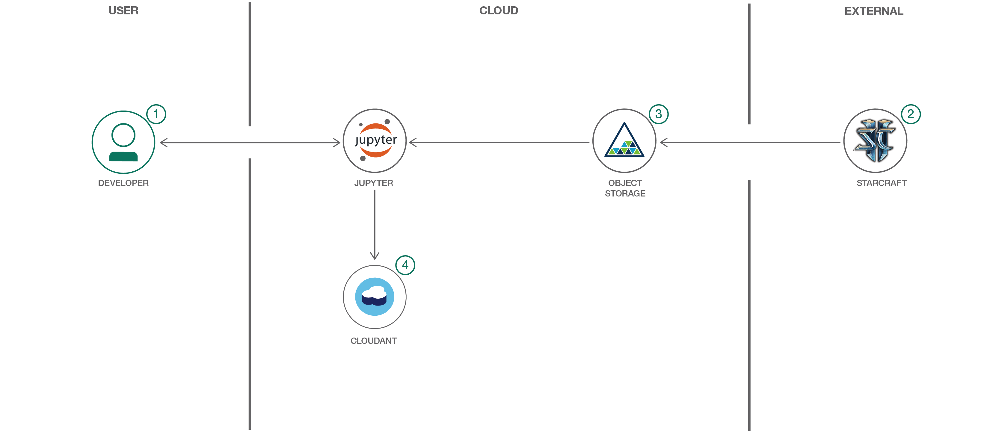

# StarCraft II Replay Analysis with Jupyter Notebooks

In this code pattern we will use Jupyter notebooks to analyze StarCraft II replays and extract interesting insights.

When the reader has completed this code pattern, they will understand how to:

* Create and run a Jupyter notebook in Watson Studio.
* Use Object Storage to access a replay file.
* Use sc2reader to load a replay into a Python object.
* Examine some of the basic replay information in the result.
* Parse the contest details into a usable object.
* Visualize the contest with Bokeh graphics.
* Store the processed replay in Cloudant.

The intended audience for this code pattern is application developers who
need to process StarCraft II replay files and build powerful visualizations.



## Flow

1. The Developer creates a Jupyter notebook from the included starcraft2_replay_analysis.ipynb file
2. A Starcraft replay file is loaded into IBM Cloud Object Storage
3. The Object is loaded into the Jupyer notebook
4. Processed replay is loaded into Cloudant database for storage

## Included components

* [IBM Watson Studio](https://www.ibm.com/cloud/watson-studio): Analyze data using RStudio, Jupyter, and Python in a configured, collaborative environment that includes IBM value-adds, such as managed Spark.
* [Cloudant NoSQL DB](https://www.ibm.com/cloud/cloudant): Cloudant NoSQL DB is a fully managed data layer designed for modern web and mobile applications that leverages a flexible JSON schema.
* [IBM Cloud Object Storage](https://www.ibm.com/cloud/object-storage): An IBM Cloud service that provides an unstructured cloud data store to build and deliver cost effective apps and services with high reliability and fast speed to market.

## Featured technologies

* [Jupyter Notebooks](https://jupyter.org/): An open-source web application that allows you to create and share documents that contain live code, equations, visualizations and explanatory text.
* [sc2reader](https://sc2reader.readthedocs.io/en/latest/): A Python library that extracts data from various [Starcraft II](https://starcraft2.com/en-us/) resources to power tools and services for the SC2 community.
* [pandas](https://pandas.pydata.org/): A Python library providing high-performance, easy-to-use data structures.
* [Bokeh](https://bokeh.pydata.org/en/latest/): A Python interactive visualization library.

## Watch the Video

[](https://www.youtube.com/watch?v=iKToQpJZIL0)

## Steps

Follow these steps to setup and run this developer code pattern. The steps are described in detail below.

1. [Clone the repo](#1-clone-the-repo)
1. [Create a new Watson Studio project](#2-create-a-new-watson-studio-project)
1. [Create a Cloudant service instance](#3-create-a-cloudant-service-instance)
1. [Create the notebook in Watson Studio](#4-create-the-notebook-in-watson-studio)
1. [Add the replay file](#5-add-the-replay-file)
1. [Add the Cloudant credentials to the notebook](#6-add-the-cloudant-credentials-to-the-notebook)
1. [Run the notebook](#7-run-the-notebook)
1. [Analyze the results](#8-analyze-the-results)
1. [Save and share](#9-save-and-share)

### 1. Clone the repo

Clone the `starcraft2-replay-analysis` repo locally. In a terminal, run:

```bash
git clone https://github.com/IBM/starcraft2-replay-analysis
```

### 2. Create a new Watson Studio project

* Log into IBM's [Watson Studio](https://dataplatform.cloud.ibm.com). Once in, you'll land on the dashboard.

* Create a new project by clicking `+ New project` and choosing `Data Science`:

  

* Enter a name for the project name and click `Create`.

* **NOTE**: By creating a project in Watson Studio a free tier `Object Storage` service and `Watson Machine Learning` service will be created in your IBM Cloud account. Select the `Free` storage type to avoid fees.

  

* Upon a successful project creation, you are taken to a dashboard view of your project. Take note of the `Assets` and `Settings` tabs, we'll be using them to associate our project with any external assets (datasets and notebooks) and any IBM cloud services.

  

### 3. Create a Cloudant service instance

* Use the menu for `Services > Data Services`, then click `+ Add service` and `Add` and `Create` a Cloudant service.
* Use the 3-dot actions menu to select `Manage in IBM Cloud` for the new Cloudant service.
* Click on `Service credentials` in the left sidebar.
* If credentials were not created, click `New credential +` to add them.
* Use the `View credentials` dropdown and copy the credentials to use in the notebook.

### 4. Create the notebook in Watson Studio

* From the new project `Overview` panel, click `+ Add to project` on the top right and choose the `Notebook` asset type.

  

* Fill in the following information:

  * Select the `From URL` tab. [1]
  * Enter a `Name` for the notebook and optionally a description. [2]
  * Under `Notebook URL` provide the following url: [https://github.com/IBM/starcraft2-replay-analysis/blob/master/notebooks/starcraft2_replay_analysis.ipynb](https://github.com/IBM/starcraft2-replay-analysis/blob/master/notebooks/starcraft2_replay_analysis.ipynb) [3]
  * For `Runtime` select the `Python 3.5` option. [4]

  

* Click the `Create` button.

* **TIP:** Once successfully imported, the notebook should appear in the `Notebooks` section of the `Assets` tab.

### 5. Add the replay file

#### Add the replay to the notebook

* This notebook uses the dataset [king_sejong_station_le.sc2replay](data/king_sejong_station_le.sc2replay). We need to load this assets to our project.

* From the new project `Overview` panel, click `+ Add to project` on the top right and choose the `Data` asset type.

   

* A panel on the right of the screen will appear to assit you in uploading data. Follow the numbered steps in the image below.

  * Ensure you're on the `Load` tab. [1]
  * Click on the `browse` option. From your machine, browse to the location of the `king_sejong_station_le.sc2replay` file in this repository, and upload it. [not numbered]
  * Once uploaded, go to the `Files` tab. [2]
  * Ensure the files appear. [3]

   

#### Create an empty cell for replay code and credentials

Use the `+` to create an empty cell to hold
the inserted code and credentials. You can put this cell
at the top or anywhere before the `Load the replay` cell.

#### Insert to code

After you add the file, use its `Insert to code` drop-down menu.
Make sure your active cell is the empty one created earlier.
Select `Insert StreamingBody object` from the drop-down menu.


Note: This cell is marked as a hidden_cell because it contains
sensitive credentials.

#### Fix-up variable names

The inserted code includes a generated method with credentials and then calls
the generated method to set a variable with a name like `streaming_body_1`. If you do
additional inserts, the method can be re-used and the variable will change
(e.g. `streaming_body_2`).

Later in the notebook, we set `replay_file = streaming_body_1`. So you might need to
fix the variable name `streaming_body_1` to match your inserted code.

### 6. Add the Cloudant credentials to the notebook

Use the `+` button above to create an empty cell to hold the credentials. You can put this cell at the top or anywhere before `Storing replay files`. You should add a `# @hidden_cell` line to help you avoid sharing credentials (but be aware that giving people access to the notebook will give them access to your credentials).

Create a variable named `credentials_1` (which is used later in the notebook) and paste the Cloudant credentials JSON as the value.  The `apikey` and `username` will be used. The other credential keys may be included -- they will be ignored.

The code cell should look like this:

```bash
# @hidden_cell
credentials_1 = {
  "apikey": "Aa_aAaaa9aAAAa9999A9aa999aaaAaaaAaaA-AAAAA-A",
  "username": "a9999aa9-9aa9-9999-aa99-9a999aaa9a99-bluemix",
  "other": "other credential keys/values are ignored..."
}
```

### 7. Run the notebook

When a notebook is executed, what is actually happening is that each code cell in
the notebook is executed, in order, from top to bottom.

Each code cell is selectable and is preceded by a tag in the left margin. The tag
format is `In [x]:`. Depending on the state of the notebook, the `x` can be:

* A blank, this indicates that the cell has never been executed.
* A number, this number represents the relative order this code step was executed.
* A `*`, this indicates that the cell is currently executing.

* Click the `(►) Run` button to start stepping through the notebook.

### 8. Analyze the results

The result of running the notebook is a report which may be shared with or
without sharing the code. You can share the code for an audience that wants
to see how you came your conclusions. The text, code and output/charts are
combined in a single web page. For an audience that does not want to see the
code, you can share a web page that only shows text and output/charts.

#### Basic output

Basic replay information is printed out to show you how you can start working
with a loaded replay. The output is also, of course, very helpful to identify
which replay you are looking at.


#### Data preparation

If you look through the code, you'll see that a lot of work went into preparing
the data.

##### Unit and building groups

List of strings were created for the _known_ units and groups. These are needed
to recognize the event types.

##### Event handlers

Handler methods were written to process the different types of events and
accumulate the information in the player's event list.

##### The ReplayData class

We created the `ReplayData` class to take a replay stream of bytes and process
them with all our event handlers. The resulting player event lists are stored
in a `ReplayData` object. The `ReplayData` class also has an `as_dict()`
method. This method returns a Python dictionary that makes it easy to process
the replay events with our Python code. We also use this dict to create a
Cloudant JSON document.

#### Visualization

To visualize the replay we chose to use 2 different types of charts and
show a side-by-side comparison of the competing players.

* Nelson rules charts
* Box plot charts

We generate these charts for each of the following metrics. You will get a
good idea of how the players are performing by comparing the trends for these
metrics.

* Mineral collection rate
* Vespene collection rate
* Active workers count
* Supply utilization (used / available)
* Worker/supply ratio (workers / supply used)

##### Box plot charts

Once you get to this point, you can see that generating a box plot is quite
easy thanks to _pandas DataFrames_ and _Seaborn BoxPlot_.

The box plot is a graphical representation of the summary statistics for the
metric for each player. The "box" covers the range from the first to the third
quartile. The horizontal line in the box shows the mean. The "whisker" shows
the spread of data outside these quartiles. Outliers, if any, show up as markers outside the whisker lines. An added swarmplot provides another representation of the distribution of values.

For each metric, we show the players statistics side-by-side using a box plots.


In the above screen shot, you see side-by-side comparison of 4 metrics.
In this contest, Neeb had the advantage. In addition to the box which shows
the quartiles and the whisker that shows the range, this example has outlier
indicators. In many cases, there will be no outliers.

##### Nelson rules charts

The Nelson rules charts are not so easy. You'll notice quite a bit of code in
helper methods to create these charts.

The base chart is a Bokeh plotting figure with circle markers for each
data point in the time series. This shows the metric over time for
the player. The player charts are side-by-side to allow separate scales
and plenty of additional annotations.

We add horizontal lines to show our x-bar (sample mean), 1st and 2nd standard
deviations and upper and lower control limits for each player.

We use our `detect_nelson_bias()` method to detect 9 or more consecutive points
above (or below) the x-bar line. Then, using Bokeh's `add_layout()` and
`BoxAnnotation`, we color the background green or red for ranges that show
bias for above or below the line respectively.

Our `detect_nelson_trend()` method detects when 6 or more consecutive points
are all increasing or decreasing. Using Bokeh's `add_layout()` and `Arrow`, we
draw arrows on the chart to highlight these up or down trends.

The result is a side-by-side comparison that is jam-packed with statistical
analysis.


In the above screen shot, you see the time/value hover details that you get
with Bokeh interactive charts. Also notice the different scales and the arrows.
In this contest, Neeb made two early pushes and got an advantage in minerals.
If you run the notebook, you'll see other examples showing where the winner
got the advantage.

#### Stored replay documents

You can browse your Cloudant database to see the stored replays. After all
the loading and parsing we stored them as JSON documents. You'll see all
of your replays in the *sc2replays* database and only the latest one in
*sc2recents*.

### 9. Save and share

#### How to save your work

Under the `File` menu, there are several ways to save your notebook:

* `Save` will simply save the current state of your notebook, without any version
  information.
* `Save Version` will save your current state of your notebook with a version tag
  that contains a date and time stamp. Up to 10 versions of your notebook can be
  saved, each one retrievable by selecting the `Revert To Version` menu item.

#### How to share your work

You can share your notebook by selecting the “Share” button located in the top
right section of your notebook panel. The end result of this action will be a URL
link that will display a “read-only” version of your notebook. You have several
options to specify exactly what you want shared from your notebook:

* `Only text and output` will remove all code cells from the notebook view.
* `All content excluding sensitive code cells`  will remove any code cells
  that contain a *sensitive* tag. For example, `# @hidden_cell` is used to protect
  your IBM Cloud credentials from being shared.
* `All content, including code` displays the notebook as is.
* A variety of `download as` options are also available in the menu.

## Sample output

The the notebook with output included can be viewed [here](https://nbviewer.jupyter.org/github/IBM/starcraft2-replay-analysis/blob/master/examples/starcraft2_replay_analysis.ipynb).

## Troubleshooting

[See DEVELOPING.md](DEVELOPING.md).

## License

This code pattern is licensed under the Apache License, Version 2. Separate third-party code objects invoked within this code pattern are licensed by their respective providers pursuant to their own separate licenses. Contributions are subject to the [Developer Certificate of Origin, Version 1.1](https://developercertificate.org/) and the [Apache License, Version 2](https://www.apache.org/licenses/LICENSE-2.0.txt).

[Apache License FAQ](https://www.apache.org/foundation/license-faq.html#WhatDoesItMEAN)
